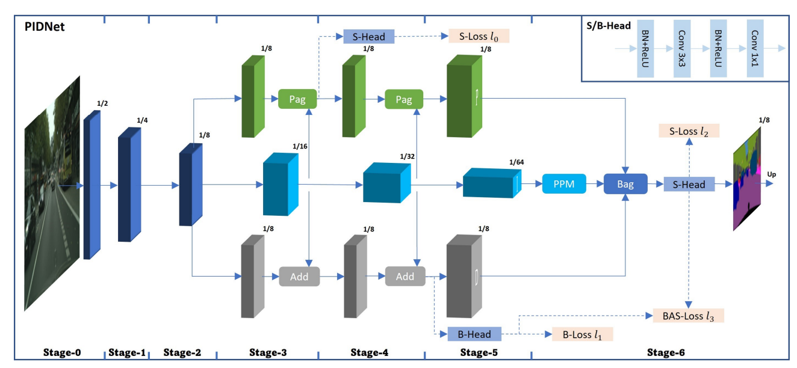

# LightRS

## Ralated Paper & Code

[PIDNet](https://arxiv.org/pdf/2206.02066v2.pdf):      [code](https://github.com/XuJiacong/PIDNet)

[SFNet-R18](https://arxiv.org/pdf/2002.10120v3.pdf):    [code](https://github.com/lxtGH/SFSegNets)

[PP-LiteSeg](https://arxiv.org/pdf/2204.02681v1.pdf):     [code](https://github.com/xiaomingnio/pp_liteseg_pytorch)

[Mobile-Former](https://arxiv.org/abs/2108.05895):    [code](https://github.com/ACheun9/Pytorch-implementation-of-Mobile-Former)

[Fast-NAS](https://arxiv.org/abs/1810.10804):    [code](https://github.com/DrSleep/nas-segm-pytorch)

## Thinking Direction

* Hardware constraint
* dataset choice
* How to deploy the model

## Dataset

### GID-15
110 7200x6800 pictures, 100 train 10 val

cut into blocks of 512×512 size

#### all label:
 ['industrial_land', 'urban_residential', 'rural_residential',
'traffic_land', 'paddy_field', 'irrigated_land', 'dry_cropland',
'garden_plot', 'arbor_woodland', 'shrub_land', 'natural_grassland',
'artificial_grassland', 'river', 'lake', 'pond', 'unknown']

#### converted label
0: low vegetable: paddy_field,irrigated_land,natural_grassland,artificial_grassland

1: high vegetable: arbor_woodland

2: others: others

3: unknown: label 0